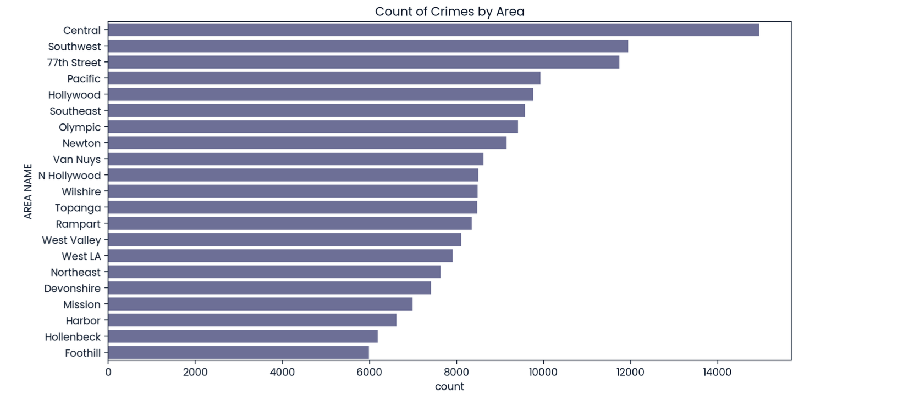
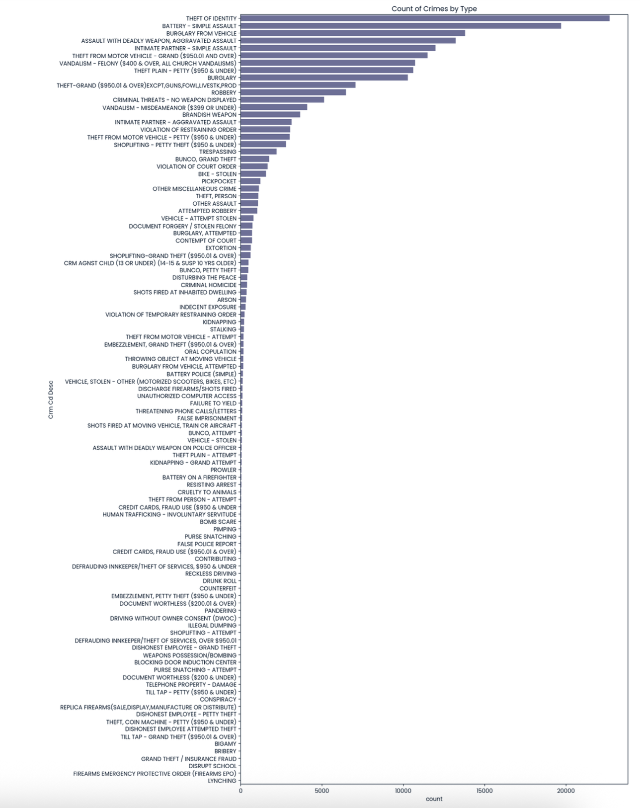
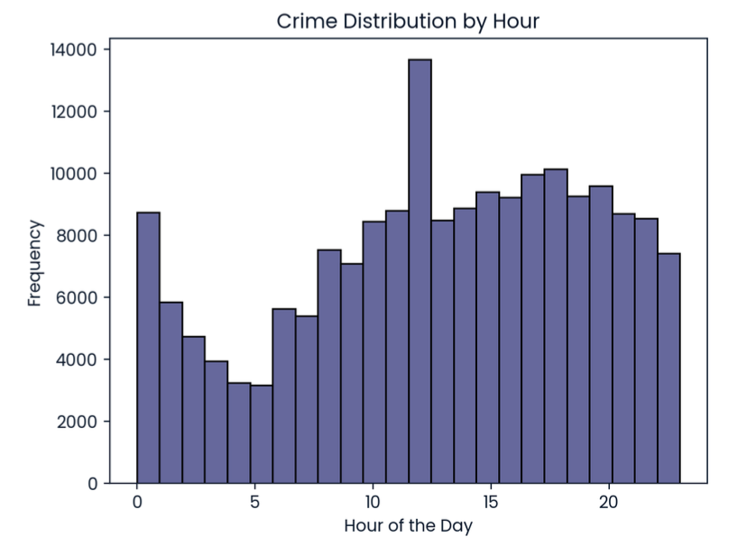
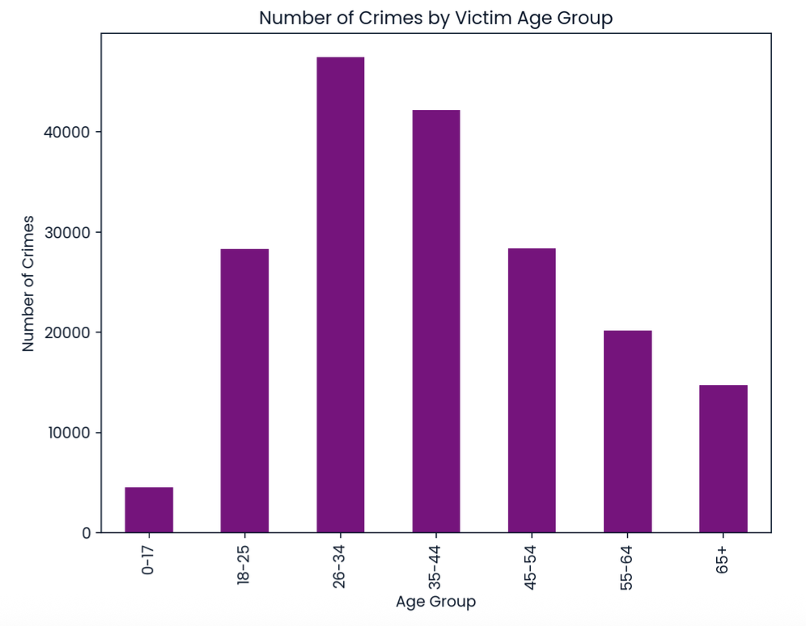
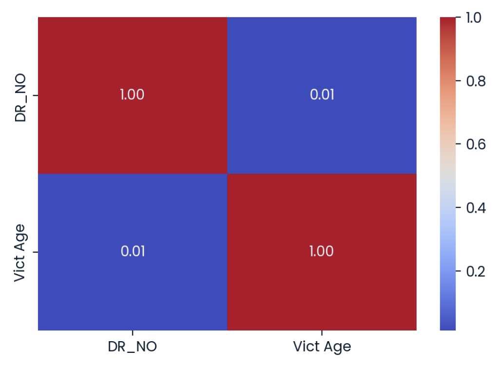

# Exploratory Data Analysis (EDA): Los Angeles Crimes Dataset  
**Prepared by Aurel Sahiti**

---

## Project Overview
Los Angeles — famous for its sunshine, coastline, and entertainment industry — also faces the complex challenge of urban crime.  
The **Los Angeles Police Department (LAPD)** provided public crime data for analysis to identify behavioral patterns and guide better resource allocation.  

This **Exploratory Data Analysis (EDA)** project transforms raw LAPD crime records into visual insights revealing where, when, and to whom crimes occur most often.  
The goal is to provide actionable intelligence to improve **community safety** and **data-driven policing**.

---

## Objectives
- Understand the **distribution of crimes** by area, type, and time.  
- Identify **peak hours** and **locations** for criminal activity.  
- Analyze **victim demographics** (age and gender).  
- Explore correlations and potential behavioral patterns to inform policy and resource deployment.

---

## Dataset Description
The dataset (`crimes.csv`) is a modified version of the publicly available **Los Angeles Open Data** on reported crimes.

| Column | Description |
|---------|-------------|
| **DR_NO** | Division of Records Number (unique case ID). |
| **Date Rptd / DATE OCC** | Date crime was reported / occurred. |
| **TIME OCC** | 24-hour timestamp of occurrence. |
| **AREA NAME** | LAPD geographic division (e.g., *Central*, *Hollywood*, *77th Street*). |
| **Crm Cd Desc** | Description of the crime committed. |
| **Vict Age**, **Vict Sex**, **Vict Descent** | Victim’s age, gender, and descent. |
| **Weapon Desc** | Weapon used, if applicable. |
| **Status Desc** | Case status (e.g., *Invest Cont*, *Adult Arrest*). |
| **LOCATION** | Street-level address. |

**Dataset size:** 185 715 records | **Period:** 2020 – 2023 :contentReference[oaicite:0]{index=0}

---

## Technologies & Tools
- **Python 3 / Jupyter Notebook**  
- **Pandas**, **NumPy** – Data wrangling  
- **Matplotlib**, **Seaborn** – Visualization  
- **Plotly** (optional) – Interactive visuals  

---

## Key Analyses & Visuals

### 1. Crimes by Area

  

The **Central Division** recorded the highest number of crimes (≈ 14 944), followed by **Southwest** (≈ 11 945) and **77th Street** (≈ 11 739).  
These three areas dominate citywide incident counts, highlighting the need for concentrated patrols and targeted interventions.

---

### 2. Crimes by Type

  

**Theft of Identity** tops the list with ≈ 22 670 cases, followed by **Simple Assault**, **Burglary from Vehicle**, and **Aggravated Assault**.  
This suggests that **fraud-related and property crimes** far exceed violent offenses, underlining the importance of digital-fraud prevention and vehicle security measures.

---

### 3. Crime Distribution by Hour

  

Criminal activity peaks at **hour 12 (≈ noon)**, with a smaller rise between **18:00–21:00**.  
Nighttime (22:00 – 03:59) incidents occur most often in the **Central Division**, indicating patterns aligned with nightlife and downtown concentration.  
These findings can inform **shift scheduling** and **lighting policy** in high-risk zones :contentReference[oaicite:1]{index=1}.

---

### 4. Victim Age Groups

  

Victims aged **26–44** represent the majority of reported incidents — approximately 47 000 (26–34) and 42 000 (35–44).  
Younger victims (0–17) account for a small fraction, suggesting most incidents involve **working-age adults**.  
These trends are useful for tailoring community-outreach and awareness programs.

---

### 6. Correlation Heatmap

  

A weak correlation (≈ 0.01) exists between **Victim Age** and other numerical attributes such as `DR_NO`.  
This confirms that **crime type and location** — rather than numeric identifiers — are stronger predictors of criminal patterns.

---

## Insights & Findings
- **Spatial:** Crime concentration is highest in *Central*, *Southwest*, and *77th Street* divisions.  
- **Categorical:** Identity theft and property crimes dominate citywide reports.  
- **Temporal:** Peak hours around noon and late evening indicate daily activity cycles.  
- **Demographic:** Most victims are aged 26–44, spanning both genders.  
- **Analytical:** No strong linear correlations exist among numeric features, suggesting multi-factor behavioral influences.

---

## Next Steps
- Integrate **geospatial heatmaps** (e.g., Folium, GeoPandas) to visualize neighborhood-level risk.  
- Build **predictive models** for crime likelihood by time and location.  
- Conduct **sentiment and text analysis** on case descriptions.  
- Automate periodic **data refresh and dashboard updates** via cloud pipelines.

---

## 👨‍💻 Author
**Aurel Sahiti**  
Data Science Graduate Student | Exploratory Analytics & Visualization  
📊 [LinkedIn](https://linkedin.com/in/aurelsahiti) | 🌐 [GitHub](https://github.com/aurelsahiti)

